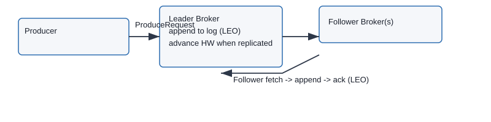

---
# Apache Kafka Internals — End-to-End Guide (Expanded)

This is a more visible copy (docs/kafka_internals.md) of the Kafka internals guide that includes deeper expansions for replication internals, transactions/EOS, compaction, and an operations appendix with CLI & JSON examples. Use this file for reading and sharing — the original under `src/main/java/...` remains for history.

Contents
- Introduction (journey of a record)
- Producer pipeline (quick)
- Broker write & ingestion (quick)
- Replication internals (expanded)
- Exactly-Once Semantics (transactions) — expanded with code example
- Log compaction & retention (expanded)
- Dead-letter & retry topics (short)
- Operational appendix: CLI commands, topic JSON examples, partition reassignment
- Quick troubleshooting checklist

---

Replication internals — expanded
================================

Why replication internals matter
- Replication is the mechanism that provides durability and availability. Understanding LEO/HW/ISR/Controller flow is essential to reason about data loss, read visibility and leader election behavior.

Key terms (concise)
- LEO (Log End Offset): the highest offset a replica has appended locally.
- LEO_local: follower's LEO; LEO_leader: leader's LEO.
- HW (High Watermark): the highest offset that the leader considers committed (safe to serve to `read_committed` consumers).
- ISR: In-Sync Replica set. Only replicas in ISR are eligible for safe leadership.

Sequence: how an append becomes committed

1. Producer sends ProduceRequest with batch ending at offset N to the leader.
2. Leader appends the batch to its active segment and increases its LEO to N.
3. Leader responds (depending on ack mode) immediately or after replication:
   - `acks=1`: leader acknowledges once local append is done (not durable until replication).
   - `acks=all`: leader waits for confirmations from replicas in ISR before acknowledging.
4. Followers poll the leader with FetchRequests for offsets > their LEO.
5. Follower receives batch, appends to its local log, updates its LEO and responds in fetch flow.
6. Leader tracks acknowledgment progress; when configured replication constraints are met, leader advances HW to N and that offset becomes visible to `read_committed` consumers.

LEO vs HW example (numbers)
- Leader LEO = 100 (leader has appended up to offset 100)
- Follower A LEO = 100, Follower B LEO = 98
- If ISR = {Leader, Follower A, Follower B} but Follower B is behind, leader will only advance HW when all required replicas have reached the offset (depending on min.insync.replicas and acks).

Failure and election flows
- If leader fails, controller selects a new leader typically from ISR.
- If `unclean.leader.election.enable=true` and no ISR member is available, controller may pick a non-ISR replica (data loss risk). Keep this false in production unless you can accept data loss.

Monitoring & metrics to inspect replication health
- `UnderReplicatedPartitions` (broker metric)
- Per-partition `LogEndOffset` and per-replica `ReplicaLag` and `ReplicaFetcher` metrics
- Use `kafka-topics.sh --describe` to inspect replicas/ISR for a topic:

```
kafka-topics.sh --bootstrap-server broker:9092 --describe --topic my-topic
# shows: Partition, Leader, Replicas, Isr, etc.
```

Detailed sequence diagram (textual)

  Producer -> Leader: Produce(batch N)
  Leader: append to segment; LEO_leader = N
  Followers -> Leader: Fetch(offset = LEO_follower + 1)
  Leader -> Followers: send batch N
  Followers: append locally; LEO_follower = N
  Leader: detect follower ack/LEO; if replication policy satisfied -> HW = N



Notes on tuning
- Reduce `replica.lag.time.max.ms` to detect slow replicas faster, but be careful to avoid noisy ISR churn.
- Tune `replica.fetch.max.bytes` and `replica.fetch.wait.max.ms` for throughput vs latency.

---

Exactly-Once Semantics (Transactions & Idempotence) — expanded
================================================================

Overview
- Idempotent producer prevents duplicate messages on retries for a given producer session.
- Transactions build on idempotence and provide atomic writes across multiple partitions and topics (from the producer's perspective), and they integrate with consumer offset commits to provide end-to-end exactly-once semantics for stream processing flows.

How idempotence works (brief)
- Producers request a ProducerId (PID) from brokers when idempotence enabled.
- Every record carries a sequence number per partition; the broker uses PID+sequence to deduplicate retried messages.

Transaction coordinator and state
- A broker acts as the Transaction Coordinator for transactional producers (based on `transactional.id`).
- Coordinator persists transaction state in `__transaction_state` and ensures atomic commit/abort semantics.

Producer transactional lifecycle (sequence)

1. `initTransactions()` — producer registers with transaction coordinator
2. `beginTransaction()`
3. send messages to multiple partitions/topics
4. optionally, write consumer offsets to `__consumer_offsets` via `sendOffsetsToTransaction()`
5. `commitTransaction()` or `abortTransaction()`

Java example (simplified) — transactional producer

```java
Properties props = new Properties();
props.put(ProducerConfig.BOOTSTRAP_SERVERS_CONFIG, "broker:9092");
props.put(ProducerConfig.KEY_SERIALIZER_CLASS_CONFIG, "org.apache.kafka.common.serialization.StringSerializer");
props.put(ProducerConfig.VALUE_SERIALIZER_CLASS_CONFIG, "org.apache.kafka.common.serialization.StringSerializer");
props.put(ProducerConfig.ENABLE_IDEMPOTENCE_CONFIG, "true");
props.put(ProducerConfig.TRANSACTIONAL_ID_CONFIG, "my-transactional-id");

KafkaProducer<String,String> producer = new KafkaProducer<>(props);
producer.initTransactions();
try {
    ---
    # Apache Kafka Internals — Complete Reference Handbook

    This is the complete, reference-style Kafka internals handbook. It is organized for platform engineers, SREs and senior application developers who need an exhaustive and operationally-focused view of Kafka internals.

    High-level structure
    - Producer internals and client semantics
    - Broker ingestion and storage engine
    - Replication, leader election and controller responsibilities
    - Exactly-once semantics and transactions (EOS)
    - Storage: compaction, retention and tiered storage
    - Consumer groups, rebalances, offsets and DLQ patterns
    - Operational guidance: admin commands, rolling upgrades, partition reassignment
    - Monitoring, metrics, alerting and runbooks
    - Security, schema and ecosystem notes

    Where the diagrams and examples live
    - Diagrams (SVG) are in `docs/images/` (replication_flow.svg, transaction_flow.svg, dlq_flow.svg). Code examples are in `docs/examples/` and monitoring configs in `docs/prometheus/` and `docs/grafana/`.

    How to use this handbook
    - Read the "Producer" and "Broker" sections to understand ingestion and durability.
    - Study "Replication" and "Transactions" for correctness guarantees and failure modes.
    - Use the Operational sections for runbooks and CLI examples.

    ---

    1. Producer internals and client semantics
    -----------------------------------------

    Summary
    - The producer pipeline turns objects into bytes, groups them into batches, and transmits them to a broker leader. Ordering, durability and latency are controlled by partitioning, `acks`, batching and retries.

    Key concepts
    - Serialization, partitioner behavior (murmur2 + sticky), RecordAccumulator, batch lifecycle, Sender thread, `acks`, `retries`, `max.in.flight.requests.per.connection`, `linger.ms`, `batch.size`, and compression types.

    Common production knobs and trade-offs
    - `acks=all` + `min.insync.replicas` = stronger durability, higher latency.
    - `linger.ms` and `batch.size` = higher throughput when increased; increases tail latency.
    - `max.in.flight.requests.per.connection` + idempotence = can increase throughput safely with modern brokers; historically set to 1 to preserve ordering on retries.

    Code examples
    - See `docs/examples/` for transactional producer and consumer examples.

    ---

    2. Broker ingestion and storage engine
    --------------------------------------

    Summary
    - Brokers accept ProduceRequests, append to partition logs (segments), maintain sparse indexes and expose data to followers and consumers. The storage engine is optimized for append-only writes and relies on the OS page cache.

    Files and layout
    - Partition directory contains multiple segments (`.log`), index (`.index`), time index (`.timeindex`) and leader epoch checkpoints.

    Important broker configs
    - `log.dirs`, `num.network.threads`, `num.io.threads`, `controlled.shutdown.enable`, `log.segment.bytes`, `log.retention.bytes`, `log.retention.ms`.

    Append path notes
    - Append operations update in-memory structures and write to disk via the OS page cache; Kafka relies on `sendfile` and sequential IO to maximize throughput.

    ---

    3. Replication, leader election and controller responsibilities
    -------------------------------------------------------------

    Core guarantees and terms
    - LEO (Log End Offset), HW (High Watermark), ISR (In-Sync Replicas), controller and controller epoch, leader epoch.

    Replication sequence (short)
    1. Producer sends batch to leader; leader appends and updates LEO.
    2. Followers poll and fetch new batches; they append locally and update their LEO.
    3. Leader tracks follower progress; when replication constraints are satisfied it advances HW and offsets become visible depending on consumer isolation.

    Failure handling and leader election
    - The controller selects new leaders from ISR. `unclean.leader.election.enable` controls whether non-ISR replicas can become leaders (dangerous for data loss).

    Operational runbook
    - Inspect `kafka-controller` logs for controller events.
    - Use `kafka-topics.sh --describe` to see Leader/Replicas/ISR status.
    - Recover slow followers by tuning follower fetch sizes or by increasing IO capacity.

    Diagram
    - See `docs/images/replication_flow.svg` (SVG). Convert to PNG if needed using Inkscape or rsvg-convert.

    ---

    4. Exactly-Once Semantics (Transactions & Idempotence)
    -----------------------------------------------------

    Overview
    - Idempotent producers prevent duplicates on retries using PID and sequence numbers. Transactions provide atomic writes across multiple partitions/topics and integrate with offsets to provide end-to-end exactly-once processing for stream applications.

    Producer transactional lifecycle and code sample
    - See `docs/examples/` for a Java transactional producer sample.

    Operational notes
    - Monitor `__transaction_state` internal topic and transaction coordinator metrics.
    - Tune `transaction.timeout.ms` appropriately; handle fence and unknown PID exceptions in client code.

    Diagram
    - See `docs/images/transaction_flow.svg`.

    ---

    5. Storage: compaction, retention and tiered storage
    ---------------------------------------------------

    Compaction details and tuning
    - Compaction rewrites segments to keep latest key versions. Tune `min.compaction.lag.ms`, `segment.bytes`, and monitor `log.cleaner` metrics.

    Retention policies
    - `cleanup.policy=delete` and `retention.ms`/`retention.bytes` control delete-based retention. Combine `compact,delete` for changelog+retention use cases.

    Tiered storage notes
    - Newer Kafka versions support moving older segments to object storage; verify read path performance and lifecycle rules.

    ---

    6. Consumer groups, rebalances, offsets and DLQ patterns
    ------------------------------------------------------

    Group coordination
    - JoinGroup, SyncGroup, heartbeat, partition assignors (Range, RoundRobin, CooperativeSticky). Prefer cooperative sticky for minimal disruption.

    Offset commit and storage
    - Offsets are stored in `__consumer_offsets` (compacted). Use manual commits when processing is non-idempotent.

    Retries and DLQ best practices
    - Use retry topics with backoff or framework support (Spring Kafka Recoverer) and publish to DLQ on permanent failures. Include metadata and avoid storing sensitive data directly in DLQ.

    Diagram
    - See `docs/images/dlq_flow.svg`.

    ---

    7. Operational guidance: admin commands, maintenance and upgrades
    -----------------------------------------------------------------

    Adding/removing brokers, reassigning partitions, and rolling upgrades
    - Always move partitions off a broker before decommissioning. Reassign partitions in small batches and throttle replication traffic.
    - Rolling upgrade steps: upgrade one broker, allow it to rejoin and catch up, repeat.

    Partition reassignment example
    - See `docs/prometheus/` and `docs/grafana/` for monitoring; use reassignment JSON with `kafka-reassign-partitions.sh`.

    Preferred leader election
    - Use `kafka-preferred-replica-election.sh` after maintenance to restore preferred leaders.

    ---

    8. Monitoring, metrics and alerting (operational details)
    --------------------------------------------------------

    Essential metrics (JMX names)
    - `kafka.server:type=ReplicaManager,name=UnderReplicatedPartitions`
    - `kafka.controller:type=ControllerStats,name=ActiveControllerCount`
    - `kafka.network:type=RequestMetrics,name=RequestsPerSec,request=Produce`
    - `kafka.server:type=ReplicaManager,name=MaxLag`
    - `kafka.coordinator.transaction:type=TransactionCoordinator,name=ActiveProducers`

    Alerting guidance
    - Critical: `UnderReplicatedPartitions > 0` sustained
    - Warning: replica lag increasing for > 5–10 minutes
    - Warning: DLQ ingestion spikes

    Dashboards and runbooks
    - Import `docs/grafana/kafka_dashboard.json` and use `docs/prometheus/kafka_rules.yml` for alert rules. Maintain runbooks with quick-check commands.

    ---

    9. Security, schema management and ecosystem notes
    ------------------------------------------------

    Security
    - Use TLS for inter-broker and client connections, enable authentication (SASL) and ACLs for authorization.

    Schema management
    - Use Schema Registry for Avro/Protobuf schemas, enforce compatibility (backward/forward/full) and automate schema rollout.

    Ecosystem
    - Kafka Streams: state stores and changelogs
    - Kafka Connect: connectors and offset storage
    - MirrorMaker / Cluster replication: cross-cluster replication strategies

    ---

    Appendices
    ---------

    - Code examples: `docs/examples/` (Spring Kafka, Kafka Streams)
    - Diagrams: `docs/images/` (SVGs). Convert to PNG with Inkscape or rsvg-convert if needed.
    - Monitoring: `docs/prometheus/kafka_rules.yml`, `docs/grafana/kafka_dashboard.json`.

    If you want, next I will:
    - Generate high-quality PNGs from the SVGs and embed them inline in this document.
    - Expand the Spring/Kafka Streams examples into runnable Maven modules with README and tests.
    - Create a one-page operator runbook PDF with the most important commands and checks.

    Tell me which of the next steps you want and I will continue.

    ---
