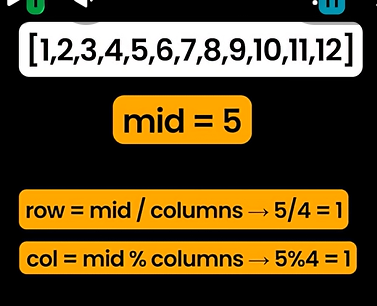
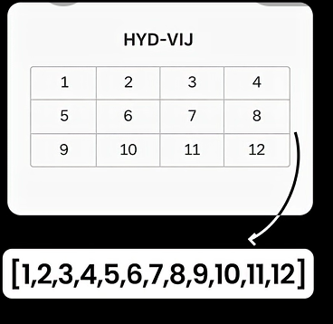

1) Why Array starts with zero beacuse

   Address = Base Address + (Index × Size of each element)

   if index is 0 then Address will point to base address.

---------------------------------------------------------------------

---------------------------------------------------------------------

2)

---------------------------------------------------------------------

---------------------------------------------------------------------

3)

