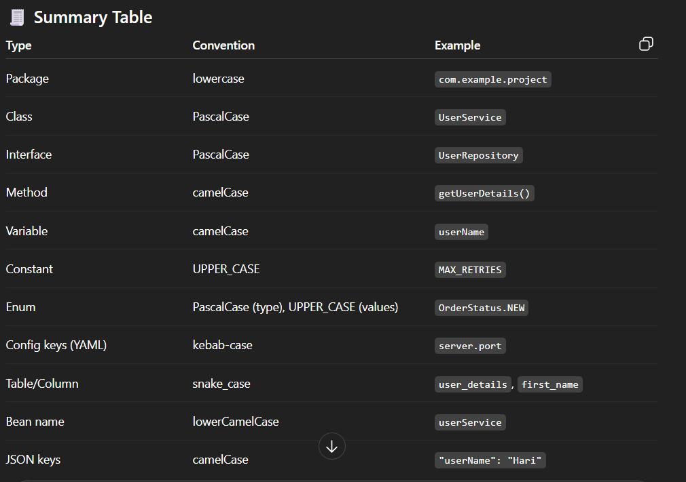

✅ **In one line (interview answer):**

> In Java and Spring Boot, we use **PascalCase** for classes, **camelCase** for variables/methods, **UPPER\_CASE** for constants, **kebab-case** for YAML keys, and **snake\_case** for database tables and columns.